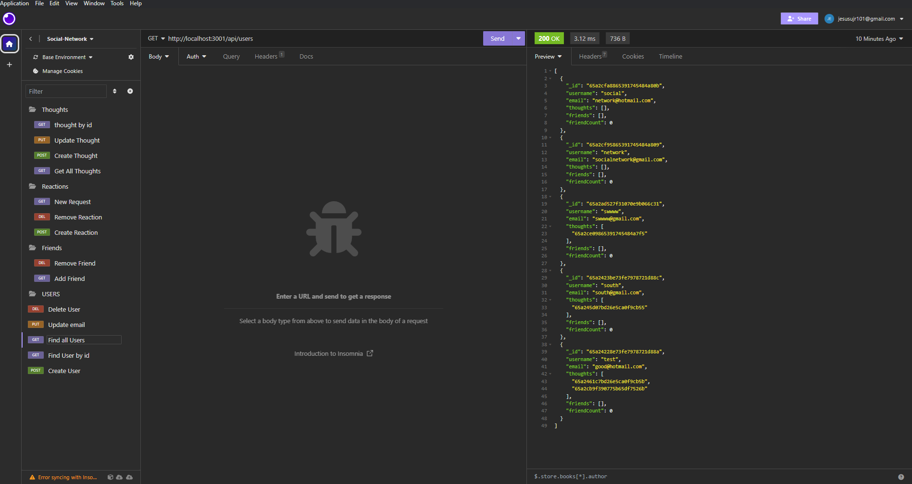
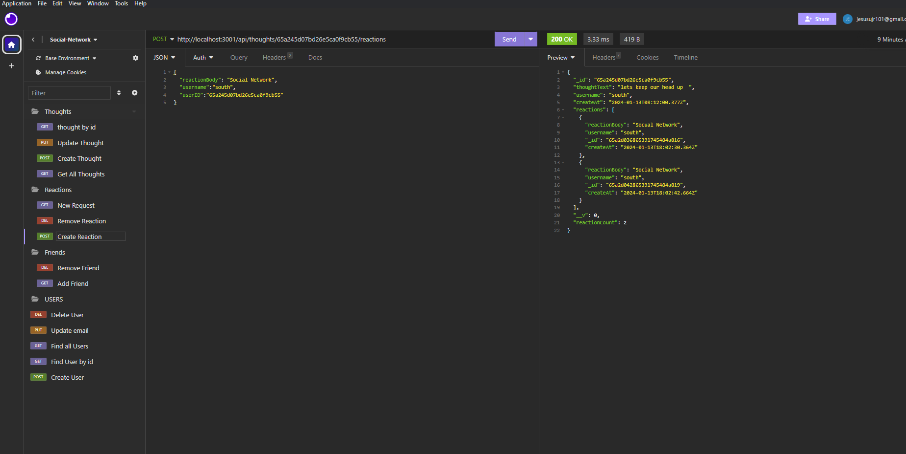
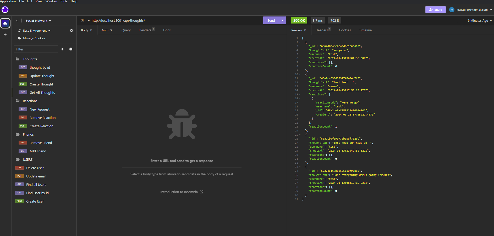

# Social-Network-api

A social network API built using Express.js and a MongoDB database.

https://github.com/Zeusjr101/Social-Network-api

https://drive.google.com/file/d/1PRFjwl6Gh9ZPe98h98OhL0NTcQnmK96a/view

To install the necessary packages, run the following command:

npm install  or npm i you would need to have node install and vscode

